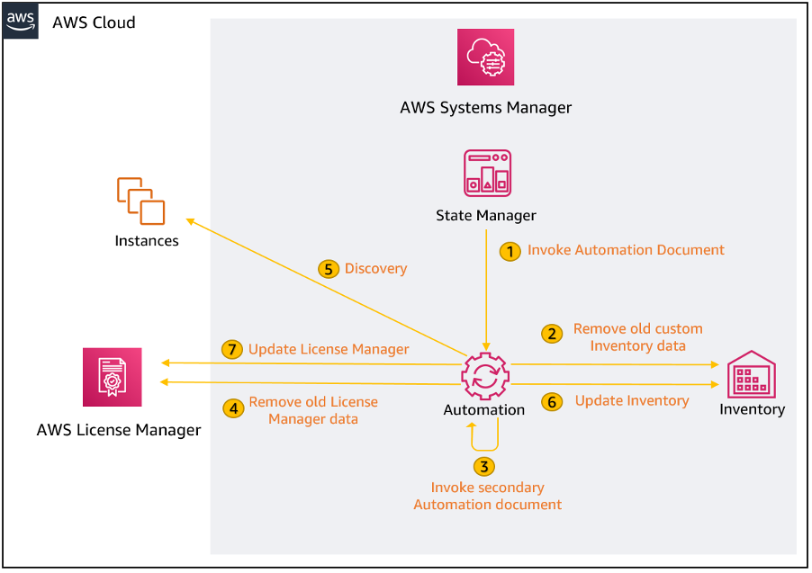
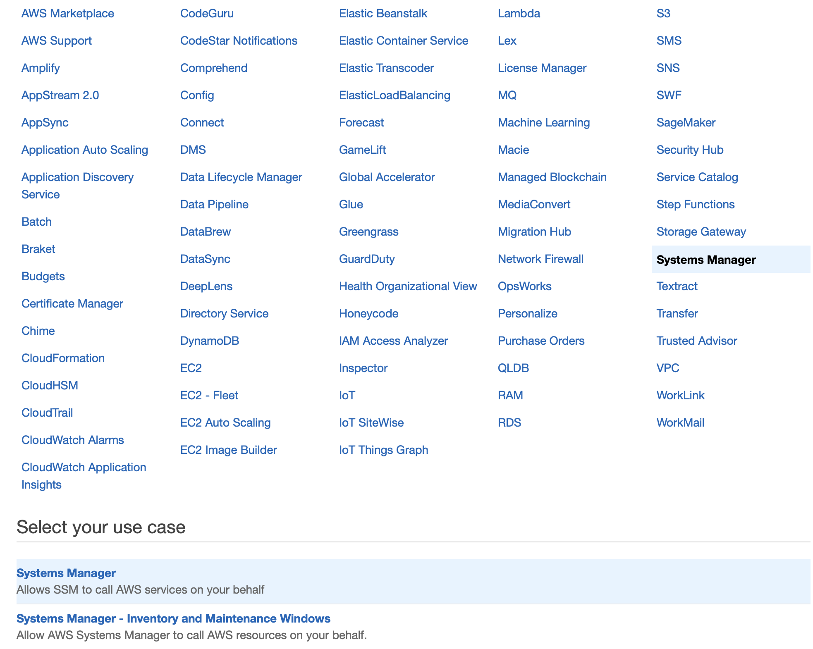
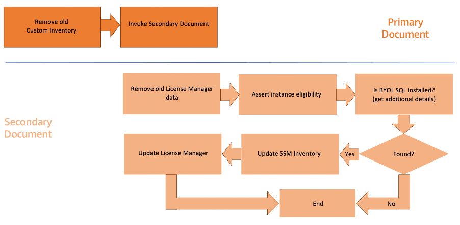
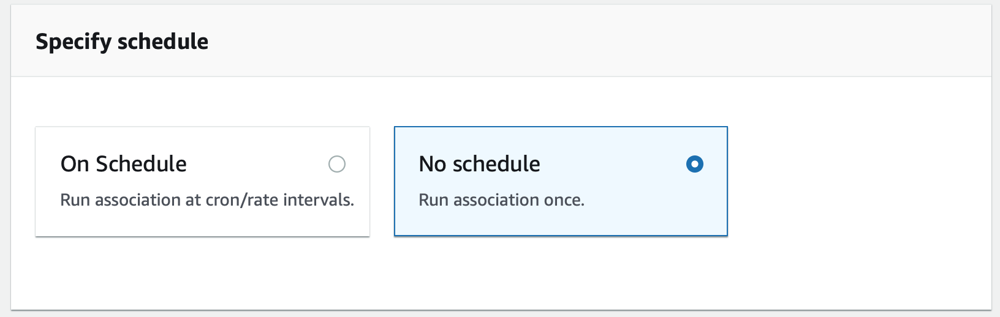
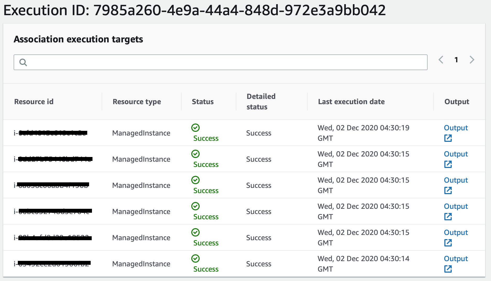
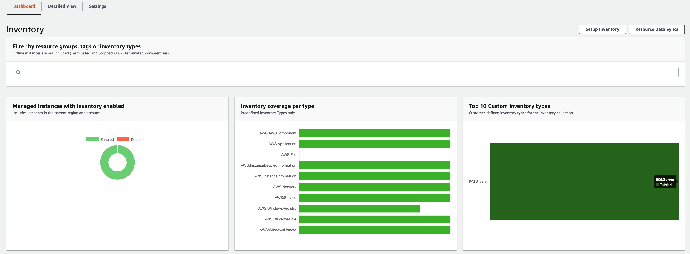
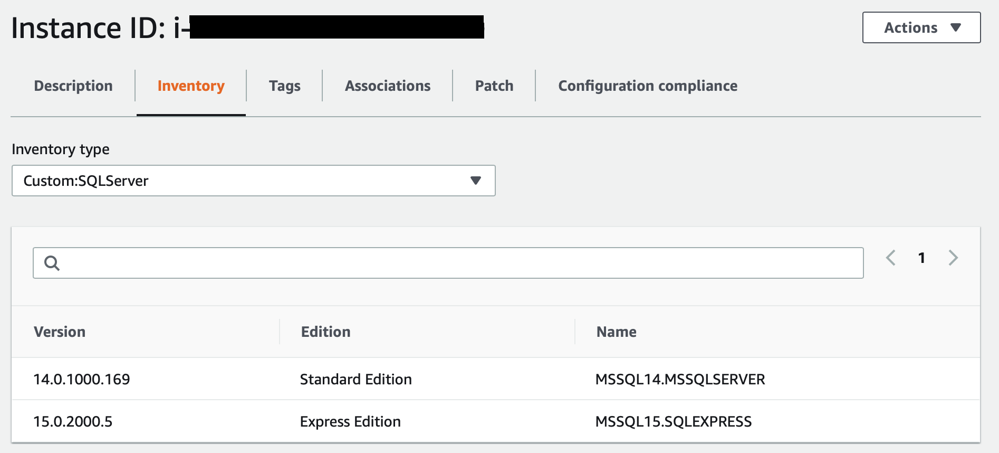
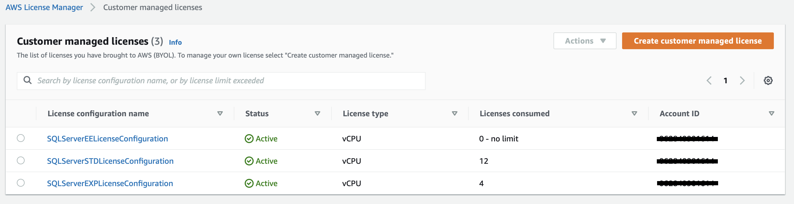
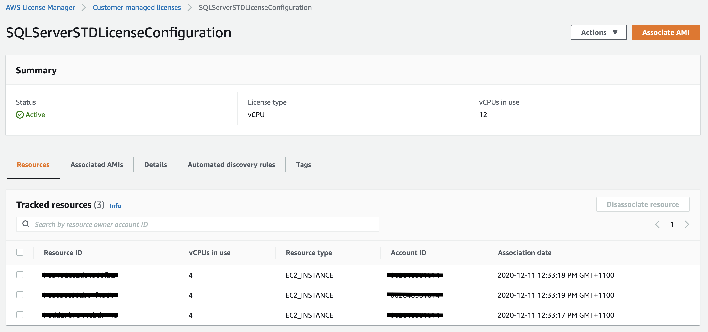

# Automatically discover SQL Server BYOL with AWS License Manager and AWS Systems Manager


Most enterprises find it hard to maintain control over commercial licensing of products like Microsoft SQL Server, Oracle, SAP and IBM due to limited visibility. Akin to challenges with provisioning their own infrastructure most customers either end up over-provisioning licenses to avoid any hassle or under-provisioning only to be faced with steep penalties. Enterprises using AWS can address this challenge in two ways:

1. Using license included instances allowing them access to fully compliant licenses, where tracking and management is being taken care of by AWS. With this option you only pay for it as you go with no upfront costs or long-term investments
2. [AWS License Manager](https://aws.amazon.com/systems-manager/features/) makes it easy for you to set rules to manage, discover and report software license usage. Using AWS License Manager to associate an Amazon Machine Image (AMI) with a licensing configuration, you can track use of licenses that you own and use in AWS or on-premises. Additionally you can set rules within License Manager to prevent licensing violations to help you stay compliant

However, it’s still possible that teams could end up provisioning software products which might not be governed by the two options described above. This could result in unwanted surprises in the next audit. In this blog post, we show you how you can build a solution that automatically discovers and tracks your software assets. We have focused on Microsoft SQL Server in this blog, however, you can employ the same approach to target other commercial software such as Oracle, SAP, or IBM.

# Overview of the solution

The following diagram illustrates the solution architecture built in this blog post. Along with AWS License Manger the solution leverages the following [features](https://aws.amazon.com/systems-manager/features/) of [AWS Systems Manager](https://aws.amazon.com/systems-manager/) (SSM):

* Automation forms the crux of this solution and orchestrates the entire workflow.
* State Manager helps maintain consistent configuration of your fleet and is used to invoke the Automation Document on a user-defined frequency.
* Inventory maintains all the information collected about the instances and the Microsoft SQL Server editions running on them.



# Walkthrough

To implement this solution, we need to complete the following steps:

1. Create the required IAM service role and policy to allow SSM to call other AWS services on your behalf
2. Create the SSM Automation Document
3. Create a SSM State Manger association which invokes the Automation Document
4. Test the solution


If you prefer to use a pre-configured CloudFormation template, launch the following stack.

[]((https://d1h72l1210l8yk.cloudfront.net/sqlserverlicensetracker/SQLServerLicenseTracker-CFnTemplate.yaml))

## Create IAM service role and policy

You need to create an IAM Policy that allows SSM to call other AWS services, such as EC2 and License Manager, to perform the required steps in the Automation Document.

1. On the IAM console, choose **Policies**
2. Choose **Create policy**
3. On the **JSON** tab, enter the following code (update the REGION, AWS-ACCOUNT-ID, and the ARN OF YOUR LICENSE CONFIGURATION accordingly, and the Document name/definition if you choose to change it):

```

  {
    "Version": "2012-10-17",
    "Statement": [
        {
            "Sid": "sid0",
            "Effect": "Allow",
            "Action": [
                "license-manager:UpdateLicenseSpecificationsForResource"
            ],
            "Resource": [
                "<ARN OF YOUR LICENSE CONFIGURATIONS>"
            ]
        },
        {
            "Sid": "sid1",
            "Effect": "Allow",
            "Action": [
                "ssm:SendCommand"
            ],
            "Resource": [
                "arn:aws:ec2:*:<AWS-ACCOUNT-ID>:instance/*",
                "arn:aws:ssm:<REGION>:<AWS-ACCOUNT-ID>:automation-definition/SQLServerLicenseTracker-Document:VersionId}",
                "arn:aws:ssm:<REGION>:<AWS-ACCOUNT-ID>:document/SQLServerLicenseTracker-Document",
                "arn:aws:ssm:<REGION>:*:document/AWS-RunPowerShellScript"
            ]
        },
        {
            "Sid": "sid2",
            "Effect": "Allow",
            "Action": "ssm:StartAutomationExecution",
            "Resource": "arn:aws:ssm:<REGION>:<AWS-ACCOUNT-ID>:automation-definition/SQLServerLicenseTracker-Document:VersionId}"
        },
        {
            "Sid": "sid3",
            "Effect": "Allow",
            "Action": [
                "ssm:DescribeAutomationExecutions",
                "ssm:GetAutomationExecution",
                "ssm:PutInventory",
                "ssm:DescribeAutomationStepExecutions",
                "ssm:ListCommands",
                "ssm:DescribeInstanceInformation",
                "ssm:SendAutomationSignal",
                "ssm:ListCommandInvocations",
                "ssm:StopAutomationExecution",
                "license-manager:ListLicenseSpecificationsForResource"
            ],
            "Resource": "*"
        }
    ]
}
```

4. Choose **Review policy**
5. For **Name**, type `SQLServerLicenseTracker-Policy`
6. For **Description**, enter `Policy used by SSM and License Manager to track your SQL Server licenses using License Manager`
7. Choose **Create policy**

Next, you need to create an IAM role and attach this policy.

8. On the IAM console, choose **Roles**
9. Choose **Create role**
10. Select **AWS service**
11. Select **Systems Manager**
12. Choose **Systems Manager** under Select your use case as shown below



13. Choose **Next: Permissions**
14. For **Filter policies**, enter `SQLServerLicenseTracker-Policy`
15. Choose **Next: Tags**
16. Choose **Next: Review**
17. For **Role name**, specify `SQLServerLicenseTracker-Role`
18. For **Description**, enter `Role used by SSM and License Manager to track your SQL Server licenses using License Manager`
19. Choose **Create role**


## Create Automation Document

With the IAM Role and Policy in place the next step is to create the Automation Document. 

1. On the AWS Systems Manager console, select **Automation** under Actions & Change.
2. Click on **Execute automation**
3. Click on **Create document**
4. Select **Editor**
5. For **Name**, specify  `SQLServerLicenseTracker-Document`
6. Click on **Edit** of the Document editor
7. Select **OK** in the confirmation prompt
8. Delete the existing content and paste the content from [SQLServerLicenseTracker-Document](SystemsManager/SQLServerLicenseTracker-Document.yaml)
9. Click on **Create automation**. Verify that the newly created document is populated under **Owned by me** section



Let’s walk through each step executed in the document as illustrated below.

1. **Assert instance eligibility (assertInstanceEligibility)**: this step checks if the EC2 instance is eligible for this document. The two criteria for this are - (i) is a SSM managed instance and is currently online, (ii) is running on a Windows operating system
2. **Remove old data if exists (removeInventoryAndLicenseConfigData)**: once we have asserted the eligibility we will need to perform two clean up tasks. Firstly, delete all the metadata associated with the [custom inventory type](https://docs.aws.amazon.com/systems-manager/latest/userguide/sysman-inventory-custom.html) created for MSSQL [“Custom:SQLServer”] on all the EC2 instances. Secondly, we remove any association to the license configuration if they exist. This gives us an opportunity to rehydrate the latest data in to both SSM Inventory and License Manager in case changes have been made
3. **Is SQL installed (isSQLServerInstalled):** in this step we check if MSSQL is installed and if it exists then retrieve the instance(s) details running on the EC2 instance using Windows Registry. The output captures the Name, Edition and Version of the Microsoft SQL Servers
4. **Conditional logic (foundSQLServerInstalledBranch):** this step performs a [branch](https://docs.aws.amazon.com/systems-manager/latest/userguide/automation-action-branch.html) out based on the evaluation of the previous step, defaulting to the next step if Microsoft SQL Server exists on the EC2 instance, or otherwise exiting if unavailable.
5. **Update SSM Inventory (updateInventory):** using the output of step 3 (metadata) we update SSM Inventory with a custom inventory of type “Custom:SQLServer” for the EC2 instance
6. **Update License Manager (updateLicenseManager):** in this last step we determine the highest edition of SQL installed and accordingly update the License Manager Configuration associated with the EC2 instance
7. **End (exitIfNoSqlServerFound):** this step is triggered if there are no SQL Server found 

## Create State Manager Association

1. Navigate to **State Manager** under Instances & Nodes in AWS Systems Manager console
2. Click on **Create association**
3. For **Name**, specify  `SQLServerLicenseTracker-Association`
4. In the search/filter for **Document** specify `SQLServerLicenseTracker-Document` and select the corresponding document
5. For Document version select **Default at runtime**
6. Choose **Rate control**
7. In the Targets section, select **InstanceId** for **Parameter** and **All Instances** for **Targets**
8. Populate the following under **Input parameters**
    1. Region: `<Region where the document was deployed in>`
    2. AccountId: `<AWS Account ID where the document was deployed in>`
    3. LicenseConfiguration(s): `<AWS License Manager Configuration ARN associated with the different editions of SQL instances>`
    4. AutomationAssumeRole: select `SQLServerLicenseTracker-Role`
9. For **Specify schedule** we recommend using the **CRON schedule builder running every day** at any time that works well for you. Shown below is an example to configure the association to run every day at 10:00 PM



10. For Rate Control we recommend setting **5** targets for **Concurrency** and **5** errors for **Error threshold** 
11. Click on **Create Association**

## Test the solution

Once an association has been created it will trigger the first run. To ensure the solution has been deployed correctly we will perform a few checks.

1. Navigate to **State Manager** in the AWS Systems Manager console
2. Search for `SQLServerLicenseTracker-Association` and click on the corresponding **Association id**
3. Select the **Execution history**
4. Click on the first **Execution id**
5. You should see a list of EC2 instances against which the association was invoked as shown below. Click on the **Output** for a few instances to see the execution details



6. Next we will verify if SSM inventory has been updated. To do this navigate to **Inventory** under Instances & Nodes. You should see a new entry ‘**SQLServer**’ in Top 10 Custom inventory types graph as shown below



7. You can also verify the details of the Inventory data which can be found under Managed Instances
    1. Navigate to **Managed Instances** under Instances & Nodes
    2. For filter type **Custom : Custom:SQLServer.Edition : Standard Edition**. If no EC2 instances are available then change the edition value to any other editions
    3. Click on one of the **EC2 instances**
    4. Click on the **Inventory** tab
    5. Under Inventory type, select **Custom:SQLServer** which should list out the SQL servers installed on the EC2 instance as shown below



8. Lastly, we will verify if the License Configuration has been updated with the latest inventory check done by our solution. Navigate to AWS License Manager console
9. Go through each of the configurations to see if they have been updated as shown below







## Conclusion

In this post, we demonstrated how you can automate the process of tracking your Microsoft SQL Server Licenses to help stay compliant with your licensing agreements using a combination of AWS License Manager and AWS Systems Manager. The same solution can be extended for other software products.

AWS License Manager allows you to track your commercial license usage and keep compliant across your enterprise teams. AWS License Manager does this through associating license definitions with AMIs from which instances are launched. AWS License Manager can also auto-discover licensed software, such as Microsoft SQL Server, that’s installed on instances after initial instance deployment. The solution introduced in this blog post enhances this capability by auto-discovery and addition of further details such as license edition. This allows you to differentiate between the various editions of SQL Server while accounting for your procured and used licenses.

This solution has been developed for a single account in a region however it can easily be expanded to work across multiple regions in a multi-account setup as well, refer to [Running automations in multiple AWS Regions and accounts](https://docs.aws.amazon.com/systems-manager/latest/userguide/systems-manager-automation-multiple-accounts-and-regions.html). 