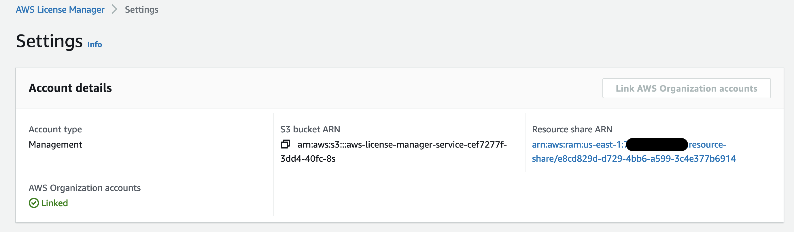
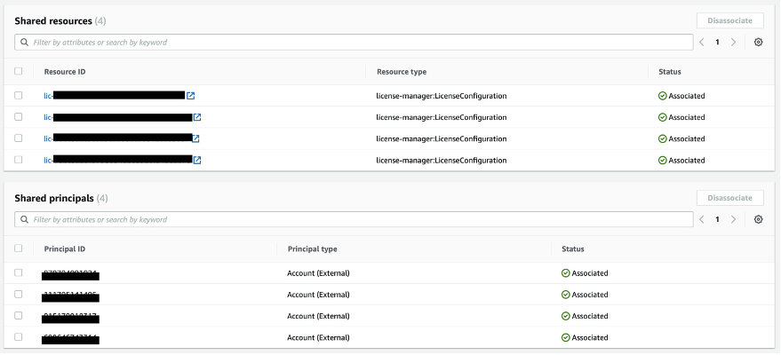
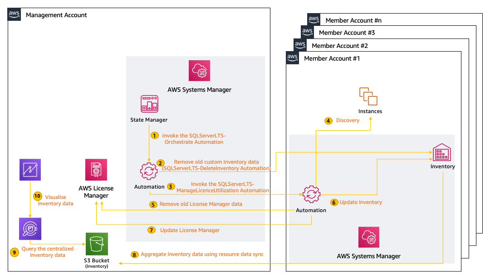
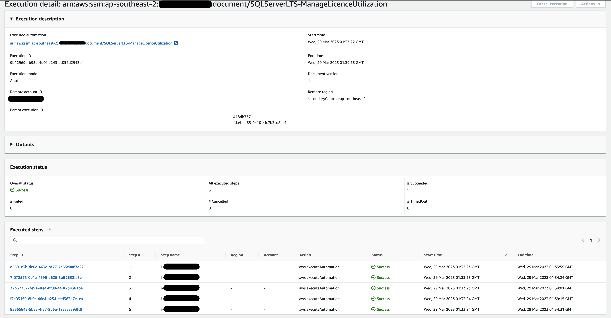

## Centrally track Microsoft SQL Server licenses in AWS Organizations using AWS License Manager and AWS Systems Manager

Most enterprises find it hard to maintain control of the commercial
licensing of Microsoft, SAP, Oracle, and IBM products due to limited
visibility. They wind up over-provisioning licenses to avoid the
headache with third-party license providers or under-provisioning
licenses, only to be faced with steep penalties.  
  
To assist enterprises with the challenge of tracking licenses, AWS has
built specific features and services to make this easier for customers.
There are two main use-cases: 

  - Using license-included instances allows you access to fully
    compliant licenses, where AWS handles the tracking and management
    for you.  

  - [AWS License Manager](https://aws.amazon.com/license-manager/) makes
    it easy for you to set rules to manage, discover, and report
    software license usage. 

There are some scenarios or software products (for example, Microsoft
SQL Server editions) that cannot be governed by these two options, which
means you could receive an unwanted surprise in the next audit. In this
first of a two-part post, I show you how to build a solution that
centrally discovers and tracks your SQL Server instances across AWS
accounts and Regions that are part of an organization in [AWS
Organizations](https://aws.amazon.com/organizations/). You can enhance
this approach to target other commercial software such as Oracle, SAP,
or IBM. For single account setups, see the [Use AWS License Manager and
AWS Systems Manager to discover SQL Server BYOL
instances](https://aws.amazon.com/blogs/mt/use-aws-license-manager-and-aws-systems-manager-to-discover-sql-server-byol-instances/)
blog post.

# Prerequisites

To deploy this solution across multiple Regions and/or accounts in 
an organization, **complete** these steps. 
  
  - **Enable trusted access with AWS Organizations for CloudFormation.** 
    Complete the following tasks as described in [Enable trusted access 
    with AWS Organizations](https://docs.aws.amazon.com/AWSCloudFormation/latest/UserGuide/stacksets-orgs-enable-trusted-access.html)
    - Enable all features in AWS Organizations. With only consolidated billing features enabled, you cannot create a stack set with service-managed permissions.  
    - Enable trusted access with AWS Organizations. After trusted access is enabled, StackSets creates the necessary IAM roles in the organization's management account and target (member) accounts when you create stack sets with service-managed permissions.
  
  - **Use a delegated administrator.** 
  This solution uses the management account within AWS Organizations, but you can also designate an account (delegated administrator) 
  to manage this on behalf of the organization. If you intend to use a delegated account then you will need to register it as delegated administrator for CloudFormation stack set operations as described in [Register a delegated administrator](https://docs.aws.amazon.com/AWSCloudFormation/latest/UserGuide/stacksets-orgs-delegated-admin.html).

  - **Distribute license configurations with member accounts in all target regions.** 
    To distribute self-managed licenses within your organization, from the License Manager console of the organization’s management account, choose Settings, and then select Link AWS Organizations accounts. When you select this option, we add a service-linked role to the management and member accounts. Repeat this step for all target regions. If you intend to use delegated administrator account, then from the License Manager console of the organization’s management account, choose Settings, and under Delegated administrator, choose Delegate administrator. Enter the account ID number for the AWS account that you want to assign, and then choose Delegate. You can’t use the ID for the management account. It must be a member account.

    Once completed, under the Settings section you should see a link to the new Resource Share ARN ([AWS Resource Access Manager (AWS RAM)](https://aws.amazon.com/ram/)), as shown in  Figure 1.


<p align="center">Figure 1: License Manager Settings with resource share ARN</p>
    

  - **Create license configurations.** In AWS License Manager, create
    license configurations for the SQL Server editions in each AWS
    Region where you will be deploying this solution. A license
    configuration represents the licensing terms in the agreement with
    your software vendor. Using [AWS CloudShell](https://aws.amazon.com/cloudshell/), 
    run the following command to create the following license configurations (case-sensitive):

    ```
    for r in {REGION-1,REGION-2}; do for i in { SQLServerEELicenseConfiguration, SQLServerSTDLicenseConfiguration, SQLServerDEVLicenseConfiguration, SQLServerWEBLicenseConfiguration, SQLServerEXPLicenseConfiguration};  do aws license-manager create-license-configuration --name "$i" --license-counting-type vCPU --region $r; done; done
    ```

    - *SQLServerEELicenseConfiguration* for Enterprise Edition
    - *SQLServerSTDLicenseConfiguration* for Standard Edition
    - *SQLServerDEVLicenseConfiguration* for Developer Edition
    - *SQLServerWEBLicenseConfiguration* for Web Edition
    - *SQLServerEXPLicenseConfiguration* for Express Edition

  - **Share license configurations.** After you have defined your
    configurations, use AWS Organizations or AWS Resource Access Manager
    to share license configurations. For instructions, see the [Tracking
    software usage across multiple AWS accounts using AWS License
    Manager](https://aws.amazon.com/blogs/mt/tracking-software-usage-across-multiple-aws-accounts-using-aws-license-manager/) blog
    post.

    After you share your principals (accounts) and resources (license configurations), you should see them in the AWS Resource Access Manager console:


<p align="center">Figure 2: Shared principals and resources in the AWS Resource Access Manager console</p>

  - **Manage instances using Systems Manager.** 
    A [managed instance](https://docs.aws.amazon.com/systems-manager/latest/userguide/managed_instances.html) is an Amazon EC2 instance that is configured for use with Systems Manager. 
    Managed instances can use Systems Manager services such as Run Command, Patch Manager, and Session 
    Manager. You must make sure that all instances targeted for this solution meet the prerequisites to 
    become a managed instance including configuring instance permissions for Systems Manager as described 
    in [Setting up Systems Manager for EC2 instances](https://docs.aws.amazon.com/systems-manager/latest/userguide/setup-instance-permissions.html).

# Solution overview

AWS License Manager allows you to track your commercial license usage to
stay compliant across your enterprise teams. It associates license
definitions with AMIs from which instances are launched. AWS License
Manager can also auto-discover licensed software (in this solution, SQL
Server) that’s installed on instances after initial instance deployment.
The solution described in this blog post enhances the auto-discovery
capability and provides license edition details for instances deployed
across AWS Regions and accounts in AWS Organizations.

Figure 3 shows the solution architecture. In addition to AWS License
Manager, the solution uses the following Systems Manager features and
capabilities:

  - [Automation](https://docs.aws.amazon.com/systems-manager/latest/userguide/systems-manager-automation.html)
    to orchestrate the workflow.

  - [State](https://docs.aws.amazon.com/systems-manager/latest/userguide/systems-manager-state.html)
    <span class="underline">Manager</span> to invoke the Automation
    document on a user-defined frequency.

  - [Inventory](https://docs.aws.amazon.com/systems-manager/latest/userguide/systems-manager-inventory.html)
    to maintain the information collected about the instances and the
    SQL Server editions running on them.


<p align="center">Figure 3: Solution architecture</p>


  1. **Invoke the SQLServerLTS-Orchestrate Automation**: State Manager invokes the SQLServerLTS-Orchestrate Automation and passes the required parameters using which the solution determines the target Organizational Unit IDs/AWS accounts and Regions where your SQL database instances are deployed.

  2. **Remove old custom Inventory data**: In this step, the Orchestrate Automation first invokes the SQLServerLTS-DeleteInventory Automation in the target member account to remove the old custom Inventory schema in Systems Manager Inventory, making sure that Inventory data is current. Inventory data comprises of Oracle database editions and all the packs installed and/or used.
  
  3. **Invoke the SQLServerLTS-ManageLicenceUtilization Automation**: Once the deletion has been completed, the SQLServerLTS-Orchestrate Automation invokes the SQLServerLTS-ManageLicenceUtilization Automation to initiate the discovery of Oracle databases in your account and track their utilization for license management.
  
  4. **Remove old License Manager data**: The Automation first disassociates the target instance from an existing License Configuration. This makes sure that the latest discovered licenses are available in License Manager for scenarios where changes have been made on the instance. For example, somebody deletes or installs a new edition of Oracle database on the target instance after the previous Automation run.
  
  5. **Discovery**: The Discover Automation then targets instances based on the State Manager association definition to determine the type of Oracle database running, and stores this data in the artifacts bucket under ssm-output. Instances can be targeted using ParameterValues, ResourceGroup or with tag: (default), AWS::EC2::Instance, InstanceIds, instanceids. Refer the API reference for Target for more details.

  6. **Update Inventory**: The discovered data is used to update the Systems Manager Inventory. In this step, Automation creates two new custom schemas along with the metadata to store the Oracle edition details along with the management packs.
  
  7. **Update License Manager**: Finally, the Automation updates the License Manager with the license utilization data and associates the target instance with the appropriate license specification that has been defined in License Manager. Discovered data under ssm-output is cleared for the next run.

  8. **Aggregate Inventory data using resource data sync**: Systems Manager resource data sync sends the Inventory data collected from all your managed instances across the member accounts to a single Amazon Simple Storage Service (Amazon S3) bucket. Then, resource data sync automatically updates the centralized data when new Inventory data is collected. 

  9. **Query the centralized Inventory data**: You can use Amazon Athena which provides an interactive query service to analyze the Inventory data in Amazon S3 using standard SQL.
  
  10. **Visualize Inventory data**: With Amazon QuickSight you can create and publish interactive BI dashboards with insights powered by machine learning (ML).


# Walkthrough

[](https://console.aws.amazon.com/cloudformation/home?region=ap-southeast-2#/stacks/new?stackName=SQLServer-LTS&templateURL=https://pb-solution-artifacts.s3.ap-southeast-2.amazonaws.com/sql-server-lts/template.yaml)

To deploy the solution, launch this CloudFormation template in the
management account of your organization. 

This template deploys the following resources:

1.  **Systems Manager documents**
    
      - SQLServerLTS-Orchestrate includes the logic to run step 1 and 3 of the walk-through.
      - SQLServerLTS-DeleteInventory includes the logic to run step 2 of the walk-through.
      - SQLServerLTS-ManageLicenceUtilization includes the logic to run steps 4-7 of the walk-through.


2.  **All the IAM roles required to deploy the solution**
    
    - SQLServerLTS-SystemsManager-AutomationAdministrationRole, for the administration of the Automation documents.
    - SQLServerLTS-SystemsManager-AutomationExecutionRole, which is deployed using StackSets across all the target accounts and regions for the execution of the Automation documents
    - SQLServerLTS-CloudFormation-StackSetAdministrationRole, to deploy the solution across multiple accounts and Regions using CloudFormation Stacksets
    - SQLServerLTS-CloudFormation-StackSetExecutionRole, to deploy the solution across multiple accounts and Regions using CloudFormation Stacksets.

3.  **S3 bucket**

    This central bucket in the management or delegated admin account stores all the data from resource data syncs across the accounts, as shown in step 8 of Figure 3.


## Centralizing Systems Manager Inventory data using resource data sync

The [resource data sync](https://docs.aws.amazon.com/systems-manager/latest/userguide/Explorer-resource-data-sync.html)
capability in AWS Systems Manager lets you sync inventory data from your
managed instances into an [Amazon Simple Storage
Service](https://aws.amazon.com/s3/) (Amazon S3) bucket. *The resource
data sync* then updates the S3 bucket whenever new Inventory data is
collected. You can also sync Inventory data from multiple AWS accounts
into a single S3 bucket, making the bucket an inventory data lake for
multiple AWS accounts. You can then use the data lake for advanced
queries and analysis of inventory data across multiple accounts. 

Refer to the instructions in [Use resource 
data sync to aggregate inventory data](https://docs.aws.amazon.com/systems-manager/latest/userguide/sysman-inventory-resource-data-sync.html) 
to create resource data syncs for your member accounts.

## Invoking the solution using a State Manager association

Use the following AWS Command Line Interface (AWS CLI) command to create an association. Update the highlighted parameters and then run this command in the management or root account of your organization.

  - **AutomationAssumeRole**: Specify your management account ID for the AutomationAssumeRole ARN.
  - **DeploymentTargets**: Enter the organizational unit IDs (for example, ou-abcd-1qwert43), AWS account IDs, or a combination of both.
  - **TargetRegions**: Specify all of the AWS Regions (for example, us-east-1) where your Oracle databases are running.
  - **MaxConcurrency** and **MaxErrors**: Specify these values based on the number of accounts and error thresholds described in [StartAutomationExecution](https://docs.aws.amazon.com/systems-manager/latest/APIReference/API_StartAutomationExecution.html#systemsmanager-StartAutomationExecution-request-MaxConcurrency) in the Systems Manager API Reference.

```
aws ssm create-association \
    --association-name "SQLServerLicenseTrackingSolutionAssociation" \
    --name "SQLServerLTS-Orchestrate" \
    --parameters '{"AutomationAssumeRole":["arn:aws:iam::ADMINISTRATOR-ACCOUNT-ID:role/SQLServerLTS-SystemsManager-AutomationAdministrationRole"],"DeploymentTargets":["OU1-ID LIKE ou-abcd-1qwert43","OU2-ID","ACCOUNT-ID"],"TargetRegions":["REGION-1 like us-east-1","REGION-2"],"MaxConcurrency":["4"],"MaxErrors":["4"]}' \
    --no-apply-only-at-cron-interval
```

**Note:** This command will invoke the system to run it once immediately after it
is created. To ensure that the solution can track licenses on an on-going schedule, 
update the above command using --schedule-expression, see
[create-association](https://awscli.amazonaws.com/v2/documentation/api/latest/reference/ssm/create-association.html)
in the AWS CLI Command Reference. 


### Validating the execution ran successfully

After the association has triggered the Automation, open the Systems Manager console in the management account, and from the left navigation pane choose Automation. 
In Automation executions, you should see the status of SQLServerLTS-Orchestrate along with SQLServerLTS-DeleteInventory and SQLServerLTS-ManageLicenceUtilization, as shown in the following figure.


<p align="center">Figure 4: Automation executions (management account)</p>

For more details on the status of individual instances, you can click on the Step ID of SQLServerLTS-ManageLicenceUtilization associated for the AWS account hosting the instance and navigate to the instance of interest, as shown in the figure below.


<p align="center">Figure 5: Automation execution detail (management account)</p>


To confirm that the license utilization data has been updated in AWS
License Manager, using the management account and selected Region, open
the **License Manager** console. Depending on the licenses consumed, the
**Customer managed licenses** list will look something like Figure 6 in 
each region:


<p align="center">Figure 6: Customer managed licenses</p>


## Adding new accounts and Regions

If you add new OU’s, accounts outside of the currently targeted OU’s or Regions, 
then you must update both the CloudFormation template and association. 
However, if you are only adding accounts to the currently targeted OU’s then you must only update the association.

**CloudFormation**:

1.  In the CloudFormation console, choose the original template you
    deployed and then choose **Update**.

2.  Leave the **Use the current template** option selected.

3.  Under **Automation Documents**, update the **TargetRegions** and
    **DeploymentTargets** parameters with the new values.

**Association**:

Update the association using the instructions provided in [Editing and creating a new version of an association](https://docs.aws.amazon.com/systems-manager/latest/userguide/sysman-state-assoc-edit.html) by updating the parameters with the new additions.

**Resource data sync**
Add new resource data sync in the account and Region as described earlier 
in the post in “Centralizing Systems Manager Inventory data using resource data sync.”

## Setup databases in Athena
Athena will help us query the aggregated data in the centralized S3
bucket created in the resource data sync step in part 1.

1.  In the Athena console, copy and paste the following statement into
    the query editor and then choose **Run Query**.

```CREATE DATABASE ssminventory```

The console creates a database named ssminventory*, *a logical grouping
for the three tables you will be creating:

  - AWS_InstanceDetailedInformation: Consists of an instance’s metadata
    like CPU, cores, and so on.

  - AWS_Tag: Consists of all the tags defined for an instance.

  - Custom_SQLServer: Consists of the SQL Server metadata, including
    edition and version, running on an instance.

For more information, see [Metadata collected by inventory](https://docs.aws.amazon.com/systems-manager/latest/userguide/sysman-inventory-schema.html)
in the AWS Systems Manager User Guide.

If you want to set up more inventory tables in Athena, see [Walkthrough:
Use resource data sync to aggregate inventory
data](https://docs.aws.amazon.com/systems-manager/latest/userguide/sysman-inventory-resource-data-sync.html). 

2.  Copy and the following statement and paste it into the query editor.
    Replace DOC-EXAMPLE-BUCKET and bucket_prefix **with the name and
    prefix of the central Amazon S3 target created in part 1.
    Choose **Run Query**.

```
CREATE EXTERNAL TABLE IF NOT EXISTS
ssminventory.AWS_InstanceDetailedInformation (  
`Cpus` string,  
`osservicepack` string,  
`cpuhyperthreadenabled` string,  
`cpuspeedmhz` string,  
`cpusockets` string,  
`cpucores` string,  
`cpumodel` string,  
`resourceid` string,  
`capturetime` string,  
`schemaversion` string  
)  
PARTITIONED BY (AccountId string, Region string, ResourceType
string)  
ROW FORMAT SERDE 'org.openx.data.jsonserde.JsonSerDe'  
WITH SERDEPROPERTIES (  
'serialization.format' = '1'  
) LOCATION
's3://DOC-EXAMPLE-BUCKET/bucket_prefix/AWS:InstanceDetailedInformation/'
```

3.  To partition the table, copy the following statement, paste it into
    the query editor, and then choose **Run Query**.

```
MSCK REPAIR TABLE ssminventory.AWS_InstanceDetailedInformation
```

**Note:** You will need to run this statement again as the partition
changes (for example, for new accounts, regions, or resource types).
Depending on how often these change in your organization, consider using
the [AWS Glue
crawler](https://docs.aws.amazon.com/glue/latest/dg/add-crawler.html) to
automate this step.

4.  To preview your data, choose **…** and then next to
    the AWS_InstanceDetailedInformation table, choose **Preview
    table**.

5.  Run the following queries individually in the Athena console to set
    up the AWS_Tag and Custom_SQLServer tables.

```
CREATE EXTERNAL TABLE IF NOT EXISTS ssminventory.AWS_Tag (  
`key` string,  
`value` string,  
`resourceid` string,  
`capturetime` string,  
`schemaversion` string  
)  
PARTITIONED BY (AccountId string, Region string, ResourceType
string)  
ROW FORMAT SERDE 'org.openx.data.jsonserde.JsonSerDe'  
WITH SERDEPROPERTIES (  
'serialization.format' = '1'  
) LOCATION 's3://DOC-EXAMPLE-BUCKET/bucket_prefix/AWS:Tag/'
```

```
MSCK REPAIR TABLE ssminventory.AWS\_Tag
```

```
CREATE EXTERNAL TABLE IF NOT EXISTS ssminventory.Custom_SQLServer (  
`name` string,  
`edition` string,  
`version` string,  
`resourceid` string,  
`capturetime` string,  
`schemaversion` string  
)  
PARTITIONED BY (AccountId string, Region string, ResourceType
string)  
ROW FORMAT SERDE 'org.openx.data.jsonserde.JsonSerDe'  
WITH SERDEPROPERTIES (  
'serialization.format' = '1'  
) LOCATION 's3://DOC-EXAMPLE-BUCKET/bucket_prefix/Custom:SQLServer/'
```

```
MSCK REPAIR TABLE ssminventory.Custom_SQLServer
```

## Visualize the data using QuickSight

Now that the data is available to access using Athena, you will use QuickSight to visualize it. 

### Prepare the dataset

Amazon QuickSight provides out-of-the-box integration with Athena. For
more information, see [Creating a Dataset Using Amazon Athena
Data](https://docs.aws.amazon.com/quicksight/latest/user/create-a-data-set-athena.html).

Use the ssminventory database that you created in the previous step. To
try out different combinations for analysis and visualization, create
three datasets in QuickSight. To simplify the experience of visualizing
data in QuickSight, you can build
[views](https://docs.aws.amazon.com/athena/latest/ug/views.html) in
Athena.

1.  In the Amazon QuickSight console, select **custom\_sqlserver** and
    then choose **Edit/Preview data**.


<p align="center">Figure 7: Creating a dataset in QuickSight</p>


2.  In the editor view, choose **Add data**, and then select the other
    tables as shown in Figure 8.


<p align="center">Figure 8: QuickSight dataset editor</p>


3.  Update the join configuration using **resourceid** as the join
    clause, as shown in Figure 9.


<p align="center">Figure 9: Specifying the join configuration</p>

4.  Before you apply the changes, exclude all duplicate fields and
    update the data types as shown in Figure 10. 


<p align="center">Figure 10: Excluded fields</p>

You can use the dataset you just created to build your own analysis and
create visualizations as shown in Figure 11. To stay informed about
important changes in your data, you can create threshold alerts using
KPI and Gauge visuals in an Amazon QuickSight dashboard. For
information, see [Working with Threshold Alerts in Amazon QuickSight](https://docs.aws.amazon.com/quicksight/latest/user/threshold-alerts.html).
With these alerts, you can set thresholds for your data and be notified
by email when your data crosses them. 


<p align="center">Figure 11: QuickSight analysis</p>


# Conclusion

In this solution, I showed how you can use AWS License
Manager and AWS Systems Manager to automate the process of tracking
your [Microsoft SQL Server
licenses](https://aws.amazon.com/windows/resources/licensing/) across
multiple accounts and Regions that are part of AWS Organizations. I also
showed you how to use Amazon Athena and Amazon QuickSight to visualize
the aggregated license consumption data across your AWS accounts. You
can easily expand on the analysis and dashboards described in this post
to meet your organization’s needs. With improved visibility of your
license consumption across your organization, you can ensure you are
compliant with your commercial licensing agreements and avoid steep
penalties.
