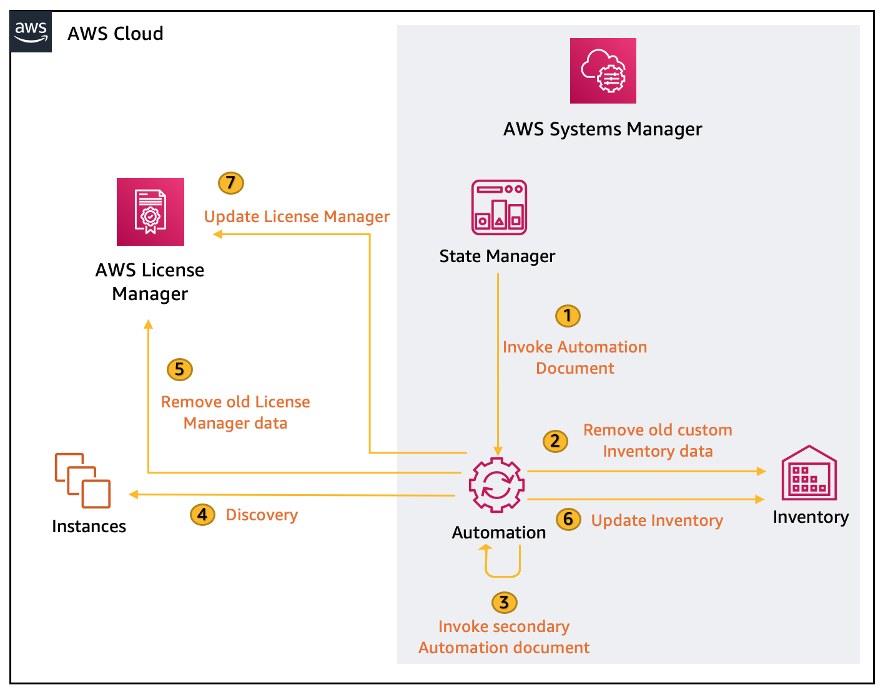
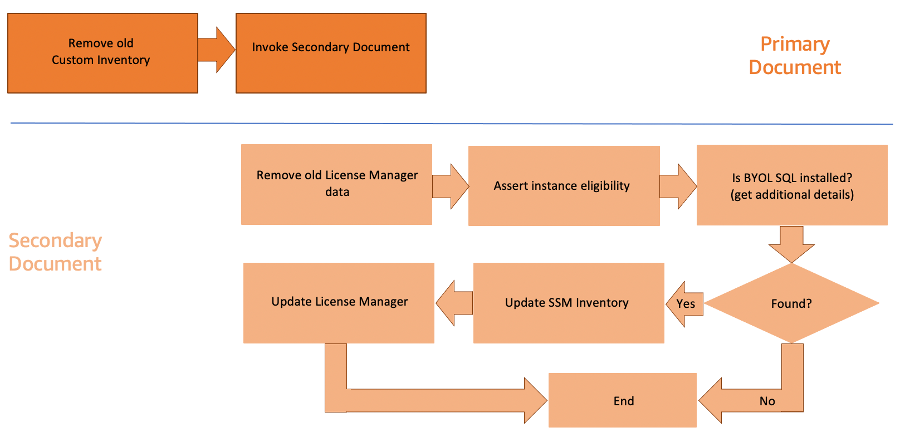
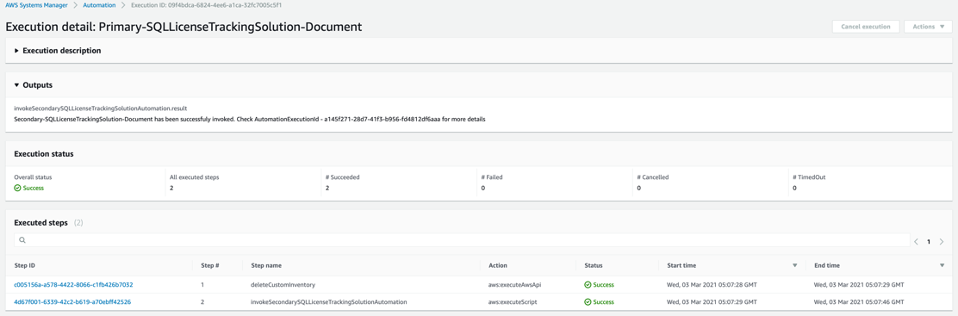
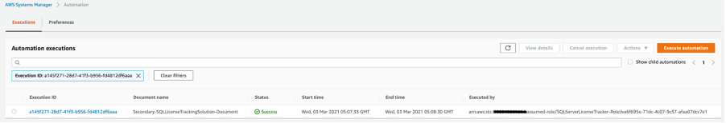
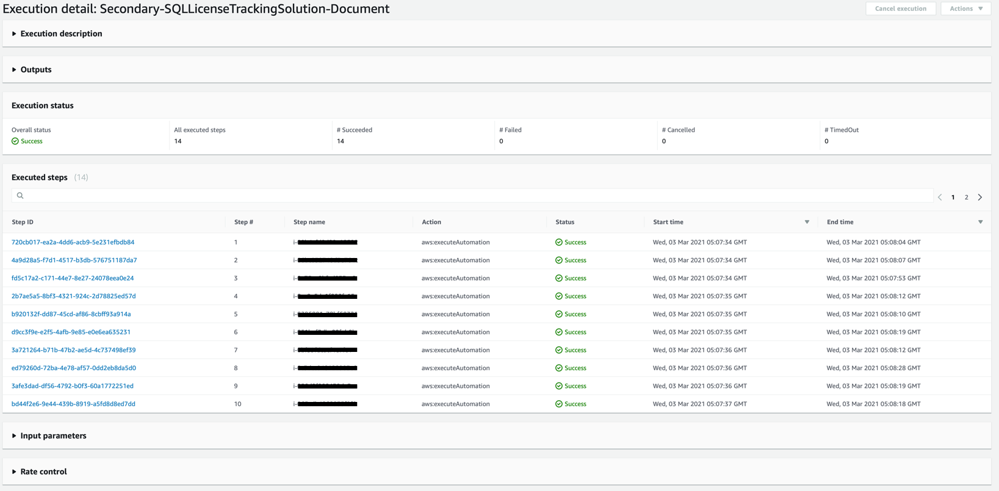
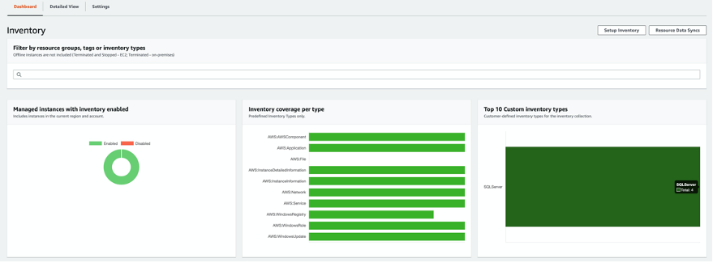
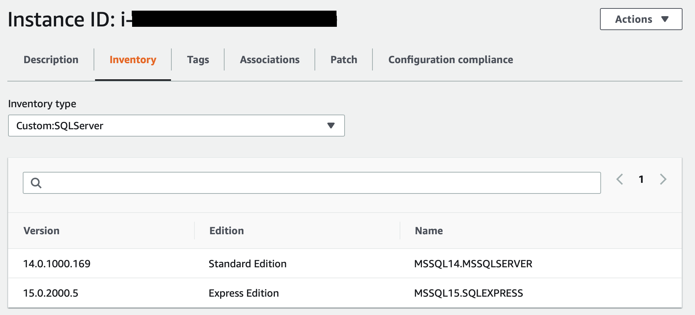
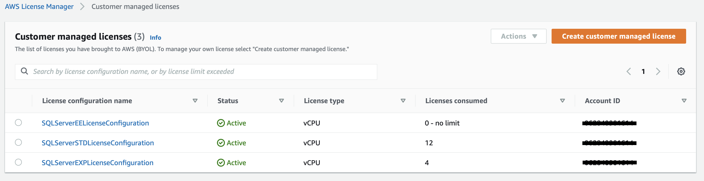
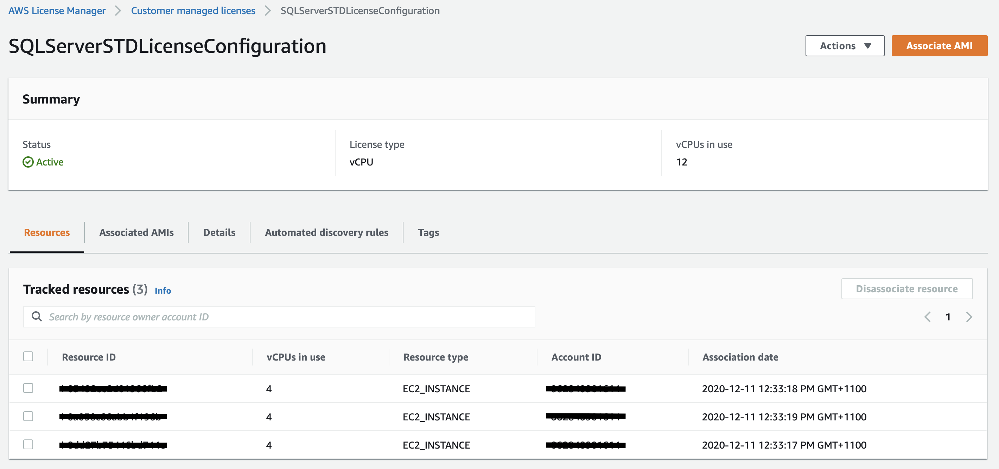

# Use AWS License Manager and AWS Systems Manager to discover SQL Server BYOL instances


Most enterprises find it hard to maintain control of the commercial licensing of Microsoft, SAP, Oracle, and IBM products due to limited visibility. They wind up over-provisioning licenses to avoid any hassle or under-provisioning licenses, only to be faced with steep penalties. 

If your enterprise uses AWS, you can address this challenge in two ways:

* Using license-included instances allows you access to fully compliant licenses, where AWS handles the tracking and management for you. With this option, you pay as you go, with no upfront costs or long-term investment.
* AWS License Manager [AWS License Manager](https://aws.amazon.com/systems-manager/features/) makes it easy for you to set rules to manage, discover, and report software license usage. When you use AWS License Manager to associate an Amazon Machine Image (AMI) with a licensing configuration, you can track the use of licenses in AWS or your on-premises environment. You can also set rules in AWS License Manager to prevent licensing violations to help you stay compliant.

It’s still possible that your teams might provision software products not governed by these two options, which means you could receive an unwanted surprise in the next audit. 

In this blog post, we show you how to build a solution that discovers and tracks your Microsoft SQL Server instances. You can enhance this approach to target other commercial software such as Oracle, SAP, or IBM.


# Solution overview

AWS License Manager allows you to track your commercial license usage to stay compliant across your enterprise teams. It associates license definitions with AMIs from which instances are launched. AWS License Manager can also auto-discover licensed software (in this solution, Microsoft SQL Server) that’s installed on instances after initial instance deployment. The solution described in this blog post enhances the auto-discovery capability and provides license edition details. 

In addition to AWS License Manager, the solution uses the following [AWS Systems Manager](https://aws.amazon.com/systems-manager/) features:
* [Automation](https://docs.aws.amazon.com/systems-manager/latest/userguide/systems-manager-automation.html) orchestrates the entire workflow.
* [State Manager](https://docs.aws.amazon.com/systems-manager/latest/userguide/systems-manager-state.html) invokes the Automation document on a user-defined frequency.
* [Inventory](https://docs.aws.amazon.com/systems-manager/latest/userguide/systems-manager-inventory.html) maintains all the information collected about the instances and the Microsoft SQL Server editions running on them.



<p align="center">Figure 1: Solution architecture</p>


# Walkthrough

To implement this solution, we need to complete the following steps:

1.	Create the IAM service role and policy that allow AWS Systems Manager to call other AWS services on your behalf.
2.	Create the Automation documents.
3.	Create a State Manager association, which invokes the Automation document.
4.	Test the solution.

If you prefer to use a CloudFormation template to create these resources, launch the following stack.

[]((https://console.aws.amazon.com/cloudformation/home?region=ap-southeast-2#/stacks/new?stackName=MSSQL-LT-Solution&templateURL=https://sql-lts-cfn-templates.s3-ap-southeast-2.amazonaws.com/single-account/SQLServerLicenseTrackingSolution-template.yaml))

## Create an IAM service role and policy

Create an IAM policy that allows Systems Manager to call other AWS services, such as Amazon Elastic Compute Cloud (Amazon EC2) and AWS License Manager, to perform the steps in the Automation document.
1.	In the AWS Identity and Access Management console, choose Policies, and then choose Create policy.
2.	On the JSON tab, enter the following code. Supply values for **REGION**, **AWS-ACCOUNT-ID**, and **ARN OF YOUR LICENSE CONFIGURATION**.

```
  {
    "Version": "2012-10-17",
    "Statement": [
        {
            "Sid": "sid0",
            "Effect": "Allow",
            "Action": [
                "license-manager:UpdateLicenseSpecificationsForResource"
            ],
            "Resource": [
                "(ARN OF YOUR LICENSE CONFIGURATIONS)"
            ]
        },
        {
            "Sid": "sid1",
            "Effect": "Allow",
            "Action": [
                "ssm:SendCommand"
            ],
            "Resource": [
                "arn:aws:ec2:*:(AWS-ACCOUNT-ID):instance/*",
                "arn:aws:ssm:(REGION):(AWS-ACCOUNT-ID):automation-definition/Primary-SQLServerLicenseTrackingSolution-Document:VersionId}",
                "arn:aws:ssm:(REGION):(AWS-ACCOUNT-ID):document/Primary-SQLServerLicenseTrackingSolution-Document",
                "arn:aws:ssm:(REGION):(AWS-ACCOUNT-ID):automation-definition/Secondary-SQLServerLicenseTrackingSolution-Document:VersionId}",
                "arn:aws:ssm:(REGION):(AWS-ACCOUNT-ID):document/Secondary-SQLServerLicenseTrackingSolution-Document",
                "arn:aws:ssm:(REGION):*:document/AWS-RunPowerShellScript"
            ]
        },
        {
            "Sid": "sid2",
            "Effect": "Allow",
            "Action": "iam:PassRole",
            "Resource": "arn:aws:iam::(AWS-ACCOUNT-ID):role/SQLServerLicenseTrackingSolution-Role"
        },
        {
            "Sid": "sid3",
            "Effect": "Allow",
            "Action": [
                "ssm:DeleteInventory",
                "ssm:PutInventory",
                "ssm:StartAutomationExecution",
                "ssm:ListCommands",
                "ssm:DescribeInstanceInformation",
                "ssm:ListCommandInvocations",
                "ssm:UpdateInstanceAssociationStatus",
                "ec2:DescribeInstances",
                "ec2:DescribeTags",
                "license-manager:ListLicenseSpecificationsForResource",
                "ec2messages:GetEndpoint",
                "ec2messages:FailMessage",
                "ec2messages:AcknowledgeMessage",
                "ec2messages:SendReply",
                "ec2messages:GetMessages",
                "tag:GetResources"
            ],
            "Resource": "*"
        }
    ]
}
```

4. Choose **Review policy**
5. For **Name**, enter `SQLServerLicenseTrackingSolution-Policy`
6. For **Description**, enter `Policy used by SSM and License Manager to track your SQL Server licenses using License Manager`
7. Choose **Create policy**
8. Next, you need to create an IAM role. In the IAM console, choose **Roles**, and then choose **Create role**
9. On the **Select role type** page, choose **AWS service**, and then choose **Systems Manager**
10. Under **Select your use case**, choose **Systems Manager**
11. Choose **Next: Permissions**
12. For **Filter policies**, enter `SQLServerLicenseTrackingSolution-Policy`
13. Choose **Next: Tags**
14. Choose **Next: Review**
15. For **Role name**, enter `SQLServerLicenseTrackingSolution-Role`
16. For **Description**, enter `Role used by SSM and License Manager to track your SQL Server licenses using License Manager`
17. Choose **Create role**


## Create the Automation Documents

1.	In the AWS Systems Manager console, under **Actions & Change**, choose **Automation**.
2.	Choose **Execute automation**, choose **Create document**, and then choose **Editor**.
3.	For **Name**, enter  `Primary-SQLServerLicenseTrackingSolution-Document`.
4.	In the editor, choose **Edit**, and then choose **OK** to confirm.
5.	Delete the existing content and paste the contents of [Primary-SQLServerLicenseTrackingSolution-Document.yaml](SystemsManagerAutomation/Primary-SQLServerLicenseTrackingSolution-Document.yaml).
6.	Choose **Create automation**, and then verify that the newly created document is displayed under Owned by me.
7.	Follow the same steps described above to create the secondary Automation document - `Secondary-SQLServerLicenseTrackingSolution-Document` using the contents of [Secondary-SQLServerLicenseTrackingSolution-Document.yaml](SystemsManagerAutomation/Secondary-SQLServerLicenseTrackingSolution-Document.yaml).


<p align="center">Figure 2: Execution sequence of Automation document</p>

The steps in the primary document are executed in the following order.
1.	**Remove old Custom Inventory (deleteCustomInventory)**: This clean up task deletes all the metadata associated with the [custom inventory type](https://docs.aws.amazon.com/systems-manager/latest/userguide/sysman-inventory-custom.html) created for MSSQL `Custom:SQLServer` on all the EC2 instances. 
2.	**Invoke Secondary Document (invokeSecondarySQLServerLicenseTrackingSolutionDocument)**: This step invokes the SecondarySQLServerLicenseTrackingSolutionDocument automation


The steps in the secondary document are executed in the following order.

1.	**Remove old License Manager data (removeLicenseConfigDataForInstance)**: This step performs a clean-up task, removing any association to the license configuration if they exist. This gives us an opportunity to rehydrate the latest data to License Manager in case changes have been made. 
2.	**Assert instance eligibility (assertInstanceEligibility)**: Checks if the EC2 instance is eligible for this document. The two criteria are:
  •	The instance is managed by Systems Manager and currently online.
  •	The instance is running on a Windows operating system.
3.	**Is BYOL SQL installed (isBYOLSQLServerInstalled)**: Checks if Microsoft SQL Server is installed, is not a SQL Server License Included instance and if it exists then retrieve the SQL Server(s) details running on the EC2 instance using Windows Registry. The output captures the Name, Edition and Version of the SQL Servers 
4.	**Conditional logic (foundSQLServerInstalledBranch)**: Performs a [branch](https://docs.aws.amazon.com/systems-manager/latest/userguide/automation-action-branch.html) action based on the evaluation of the previous step. Defaults to the next step if MSSQL exists on the EC2 instance. Exits if unavailable.
5.	**Update SSM Inventory (updateInventory)**: Uses the output of step 3 (metadata) to update Inventory with a custom inventory of type Custom:SQLServer for the EC2 instance.
6.	**Update AWS License Manager (updateLicenseManager)**: Determines the most recent edition of SQL Server installed and updates the AWS License Manager configuration associated with the EC2 instance accordingly.
7.	**End (exitIfNoSqlServerFound)**: Is triggered if no SQL Server instances are found. 

## Create State Manager association

1.	In the AWS Systems Manager console, under Instances & Nodes, choose State Manager, and then choose Create association.
2.	For Name, enter  SQLServerLicenseTrackingSolution-Association.
3.	In the search field, enter Primary-SQLServerLicenseTrackingSolution-Document, and then choose it in the results.
4.	For Document version, choose Default at runtime.
5.	Choose Simple execution. 
6.	Under Input parameters, enter the following:
  * InstanceId: `<Use * to target all instances in this account or specify an individual instance ID, the default is *>`
  * TagKey: `<Specify a Tag name that will be used to filter the managed instances for this solution, the default value is LicenseTrackingSolution-ManagedInstance. Ensure the same key is used to tag your EC2 instances or virtual machines>`
  * TagValue: `<Specify the Tag value corresponding with the TagKey, the default value is true. Ensure the same value is used to tag your EC2 instances or virtual machines>`
  * Region: `<Region where you are deploying this document otherwise the region in which this document is executed will be used. Ensure the same is used to tag your EC2 instances or virtual machines>`
  * AccountId: `<Account ID where you are deploying this document otherwise the account in which this document is executed will be used>`
  * LicenseConfiguration(s): `<AWS License Manager configuration ARN associated with the editions of SQL Server running on instances>`
  * AutomationAssumeRole: choose `SQLServerLicenseTrackingSolution-Role`
9.	For Specify schedule, you can either choose **CRON schedule builder** to run at your preferred time or **No schedule** to run the association once. We configured the association to run once.
10. Choose **Create Association**

## Test the solution

After an association has been created, it will trigger the first run of the document. To ensure the solution has been deployed correctly, perform the following checks.

1.	In the AWS Systems Manager console, under **Instances & Nodes**, choose **State Manager**.
2.	Search for `SQLServerLicenseTrackingSolution-Association`, and then choose the association ID.
3.	Choose **Execution history**, and then choose the latest execution ID, and then click on the **Output** icon.
4.	Figure 3 shows a successful execution of the primary document.


<p align="center">Figure 3: Primary document execution</p>

5.	Using the AutomationExecutionID displayed in the **Outputs** section search for Execution ID under **Automation executions** in the Automation dashboard as shown in Figure 4.


<p align="center">Figure 4: Automation execution search</p>

6.	Clicking on the **Execution ID** will list out all the instances the secondary document has been targeted against as shown in Figure 5. For more details on individual instances click on the appropriate **Step ID**.


<p align="center">Figure 5: Automation execution search</p>

7.	Under **Node Management**, choose **Inventory**. In the **Top 10 Custom inventory types** window, you should see `SQLServer`, as shown in Figure 6.


<p align="center">Figure 6: Automation execution search</p>

8.	For filter type, use **Custom : Custom:SQLServer.Edition : Standard Edition** in the search bar. At the bottom of the Inventory dashboard you should see a list of corresponding managed instances. If no EC2 instances are available, change the edition value to one of the other editions.
9.	Click on one of the instance IDs, and then choose the **Inventory** tab.
10.	Under **Inventory type**, choose **Custom:SQLServer**. The SQL Server version, edition, and name is displayed, as shown in Figure 7.


<p align="center">Figure 7: Custom:SQLServer Inventory type</p>

11.	Open the AWS License Manager console to confirm that the license configuration has been updated by the solution. 
12.	In **Customer managed licenses**, review the configurations to see if they have been updated, as shown in Figure 8.


<p align="center">Figure 8: Cusomter-managed license configurations</p>

13. Choose any of the **License configuration name** which has more than 1 license consumed. All the associated instances will be listed under **Resources**, as shown in Figure 9.


<p align="center">Figure 9: Associated resources for the customer-managed license configuration</p>


## Conclusion

In this post, we showed how you can use AWS License Manager and AWS Systems Manager to automate the process of tracking your Microsoft SQL Server licenses. You can extend the solution used in this post for other software products. Although this solution was developed for a single account in a single AWS Region, you can easily expand it to work across multiple Regions in a multi-account setup. For more information, see [Running automations in multiple AWS Regions and accounts](https://docs.aws.amazon.com/systems-manager/latest/userguide/systems-manager-automation-multiple-accounts-and-regions.html) in the AWS Systems Manager User Guide.
